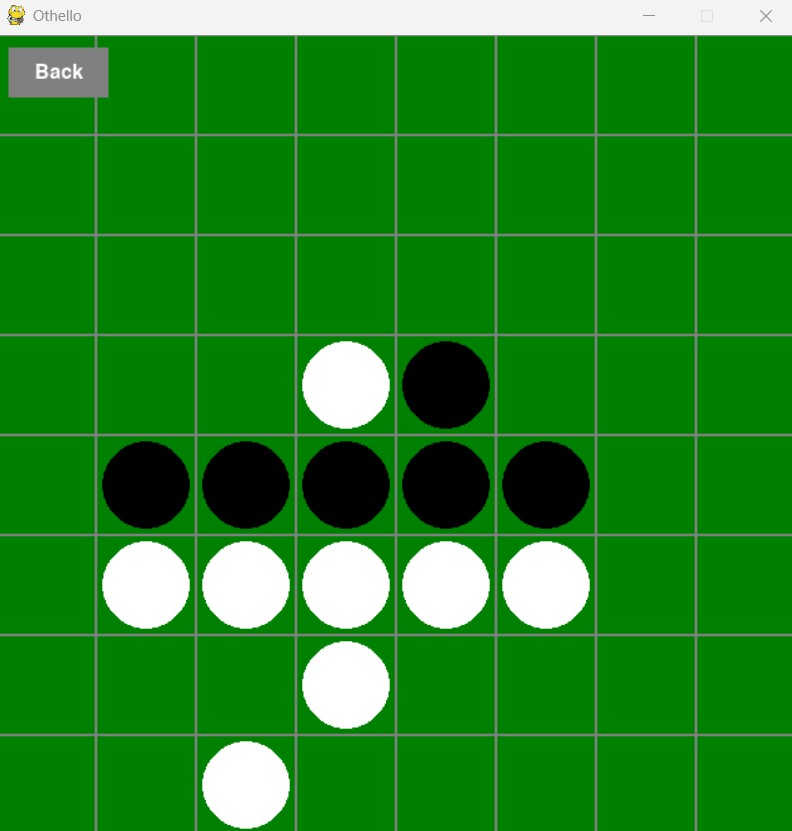

# Othello (Reversi)

Othello (Reversi) is a Python/Pygame implementation of the classic board game created for **CSE 4301: Introduction to Artificial Intelligence**.

The project supports two game modes:

- **Human vs. Human** – two players can play locally on the same board
- **Human vs. AI** – play against an AI opponent that uses **minimax with alpha-beta pruning**

The game includes move validation, automatic disc flipping, score tracking, undo support, turn skipping, and a graphical interface built with Pygame.

---

## Preview



---

## Features

### Gameplay

- Interactive **8x8 Othello board**
- Full implementation of official Othello rules
- Valid move highlighting and move enforcement
- Automatic disc flipping after each move
- Score tracking during gameplay
- End-of-game win/loss display
- Undo functionality
- Turn skipping when a player has no valid moves

### Game Modes

- **Human vs. Human**
- **Human vs. AI**

### Artificial Intelligence

- AI opponent powered by the **minimax algorithm**
- **Alpha-beta pruning** used to improve search efficiency
- Strategic move selection based on board evaluation

### Interface

- Simple graphical user interface built with **Pygame**
- Easy-to-use board interaction
- Clean visual layout for gameplay and score display

---

## AI Overview

The AI in this project uses the **minimax algorithm** to search possible future game states and choose the best move.

To make the search more efficient, the AI also uses **alpha-beta pruning**, which removes branches of the search tree that do not need to be explored. This helps the AI make decisions faster while still playing strategically.

---

## Installation

Make sure you have **Python 3.8 or later** installed.

Install the required dependency:

```bash
pip install -r requirements.txt
